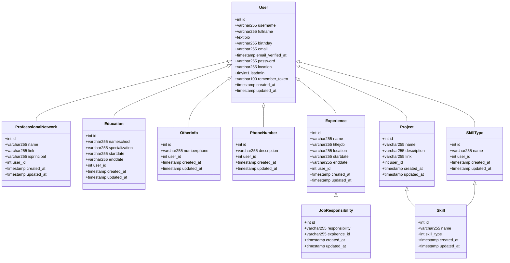

# MyPortfolio 

[ **Myportfolio**  ](https://oussamanh.com) is a web application that allows users to create a professional portfolio and showcase their work experience, skills, and projects. Some of the key features of MyPortfolio include:

-   User authentication: Users can create a private account and verify their email address to access the application.
-   Admin panel: Admins can manage all the data and profiles from a dedicated admin panel ,but a simple user can manage their data only.
-   Portfolio display: Users can present their data in a visually appealing way and showcase their work in various formats such as images, videos, and documents.
-   Downloadable CV: Users can download their CV in PDF format.
-   REST API: **MyPortfolio**  provides a REST API with over 54 requests for developers who want to create their own front-end.

to see the live version  [click here ](https://oussamanh.com).

# Programming 
This website is built using several different technologies to ensure an efficient platform. Here are some of the key components:

- [ Laravel 10  ](https://laravel.com): This is the main framework that the website is built on. In this project, i utilized several classes , including controllers, models, blades, policies, resources, and validators. Additionally, i used all the types of relationships, one-to-one, one-to-many, and many-to-many, to ensure that data was stored and retrieved efficiently.

- [ Laravel JWT ](https://jwt-auth.readthedocs.io/en/develop/): i used Laravel JWT (JSON Web Tokens) to handle authentication and user sessions. JWT is a secure and efficient way of handling user authentication, and it allowed us to build a secure platform that could handle user accounts and sessions seamlessly.

- [Spatie Media Library ](https://spatie.be/docs/laravel-medialibrary/v10/introduction): i utilized the Spatie Media Library to manage  the images on the website.  It allows developers to easily upload, store, and manipulate media easily.
- [ FilamentPhp ](https://filamentphp.com) is a powerful admin panel package for Laravel that provides a simple and elegant interface for managing resources ,
In addition , i used two  plugins :
	> the first package is [Spatie Media Library ](https://filamentphp.com/docs/2.x/spatie-laravel-media-library-plugin/installation), which provides an easy-to-use interface for uploading, deleting, and retrieving images.
	> The second package you used is[ Filament Breezy ](https://filamentphp.com/plugins/breezy), which provides registration, email verification, and password reset functionality .

- [PDF Dom ](https://dompdf.github.io): i utilized the PDF Dom library to generate the PDF cv documents on the website.
# REST API queries :

# Schema

# Contact us:
- **email:** oussamanh7@gmail.com 
- **phone:** +213696900164
- **lindekin:** https://www.linkedin.com/in/oussamanahnah/
- **fb:** https://www.facebook.com/osma0k/

# Vedio && Screenshots

